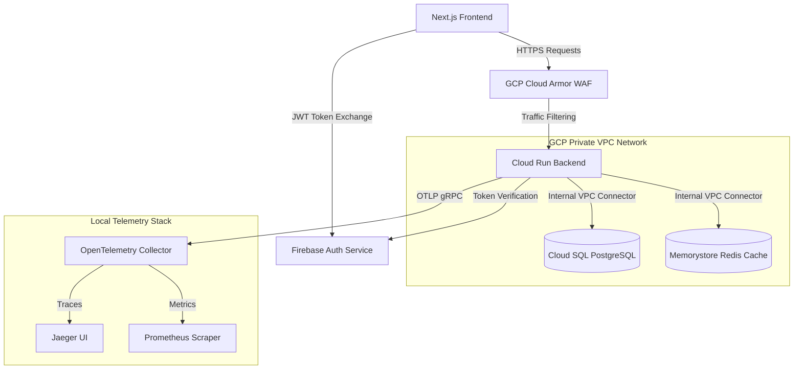
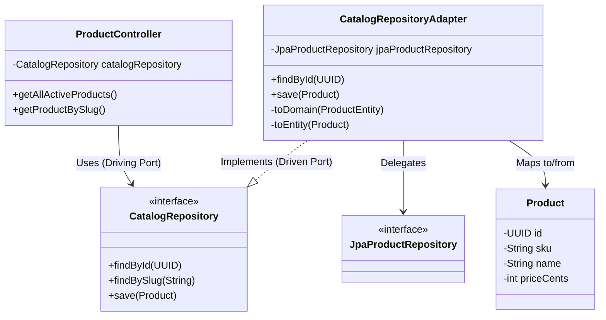
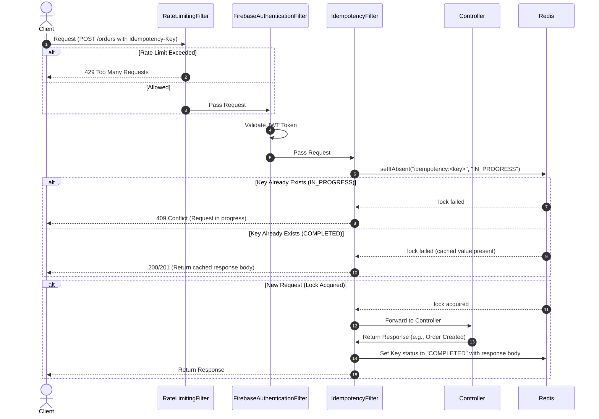
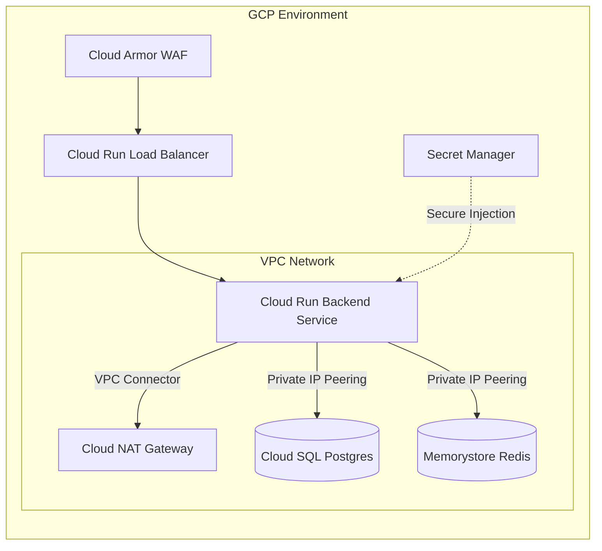
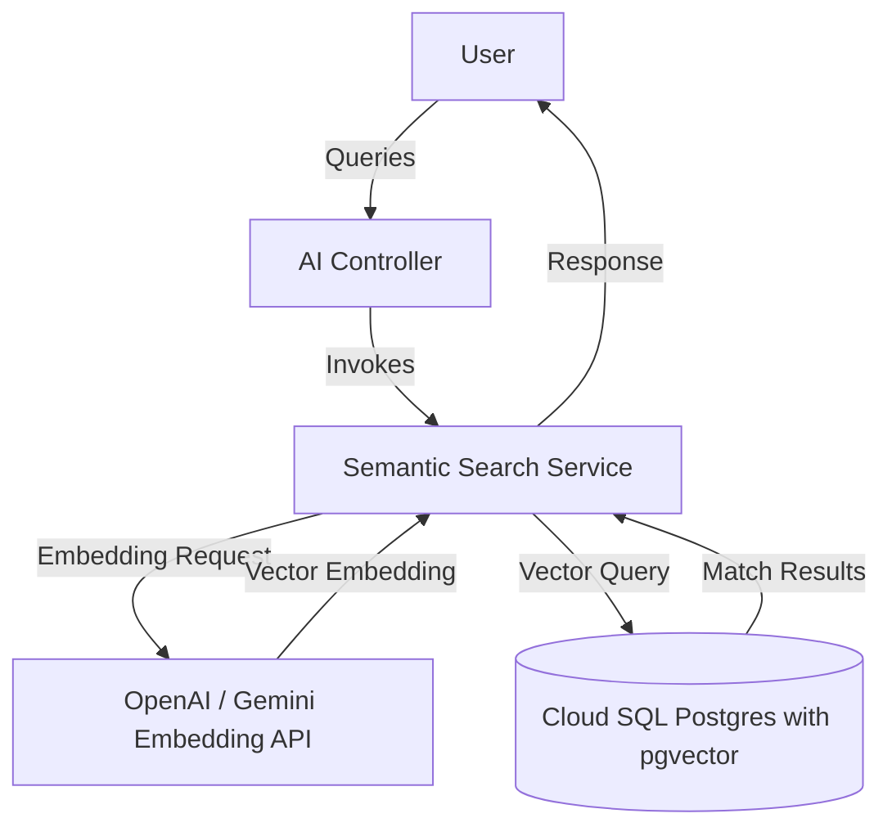
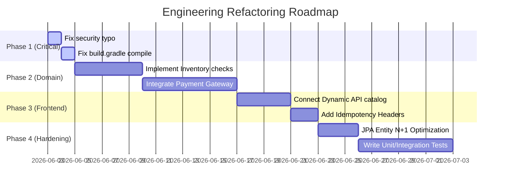

# ENTERPRISE ARCHITECTURE & CODEBASE ASSESSMENT AUDIT

**Project Name:** Herbal Tea / Wellness Platform  
**Target Repository:** `/home/tarun/data/herbaltea`  
**Auditor:** Principal Software Architect & Technical Due Diligence Consultant  
**Date of Audit:** June 2, 2026  
**Audience:** CTO, Investors, Engineering Management, Senior Development Teams  

---

## 1. Executive Summary

### 1.1 Project Purpose
The Herbal Tea / Wellness Platform is designed as a modern, full-stack e-commerce application specializing in the cataloging, sale, and distribution of small-batch organic herbal teas, adaptogens, and wellness powders. Structurally, the project targets a cloud-native architecture using a Next.js frontend, a Java Spring Boot backend, and Google Cloud Platform (GCP) infrastructure automated via Terraform.

### 1.2 Technology Stack
The platform utilizes a modern enterprise-grade stack:
*   **Frontend:** Next.js 16.2.6 (React 19), Tailwind CSS v4, Zustand 5, Framer Motion 12, TanStack React Query 5, and Firebase Client SDK.
*   **Backend:** Spring Boot 3.4.3 (Java 21), Spring Security, Spring Data JPA, Hibernate, Bucket4j (Rate Limiting), Lettuce Redis Client, and Flyway (Database Migrations).
*   **Database:** PostgreSQL 16 (for relational transactional persistence) and Redis 7 (for distributed caching, idempotency locks, and rate-limiting buckets).
*   **DevOps & Infrastructure:** GitHub Actions, Terraform 1.7+, GCP (Cloud Run, Cloud SQL, Memorystore Redis, VPC Network, Cloud Armor WAF, Secret Manager), Docker, OpenTelemetry, Jaeger, and Prometheus.

### 1.3 Current Maturity Level & Overall Score
The codebase presents a **highly bifurcated maturity level**:
1.  **Architecture Foundations (High Maturity):** The codebase uses clean, decoupled patterns (Hexagonal Architecture in the backend, modular Terraform templates, multi-stage Docker builds, OpenTelemetry tracing, and partition-based PostgreSQL schema design).
2.  **Implementation & Integration (Low Maturity):** The core e-commerce capabilities are heavily stubbed, disconnected, or incomplete. The frontend does not fetch products from the database; payments and inventory checking are stubs; and critical security configuration errors expose administrative APIs to the public internet.

The overall architectural and codebase quality score is determined to be **6.2 / 10**. While the foundation is solid, it is not production-ready due to critical security and integration blockers.

### 1.4 Architecture Quality Scores

| Area | Score / 10 | Status | Key Findings |
| :--- | :--- | :--- | :--- |
| **Architecture** | 8.0 / 10 | **Decoupled / Incomplete** | Clean Hexagonal layout, but the service orchestrator layer is missing; controllers directly call repository ports. Transactional outbox is dead code. |
| **Code Quality** | 7.0 / 10 | **Clean but Leaky** | Java domain layer is pure POJOs. However, domain models are exposed directly in REST controllers without DTO translation. |
| **Security** | 4.0 / 10 | **CRITICAL VULNERABILITY** | A path matching mismatch in `WebSecurityConfig.java` leaves the POST product creation API completely public and unauthenticated. |
| **Scalability** | 8.0 / 10 | **Highly Ready** | Database includes range partitioning on orders and audit logs, GIN indexes, Redis distributed locks, and rate-limiting buckets. |
| **Testing** | 1.0 / 10 | **BROKEN** | The backend test suite fails to compile due to non-existent Spring Boot starter test dependencies defined in `build.gradle`. Frontend has 0% coverage. |
| **DevOps** | 9.5 / 10 | **Enterprise-Grade** | Excellent GitHub Actions pipeline with Workload Identity Federation (WIF), Terraform formatting, plan checks, and automatic Cloud Run rollbacks. |
| **Maintainability** | 7.0 / 10 | **Good Structure** | Clear monorepo structure. Easy to navigate but contains unused Firestore rules and stubbed backend packages. |
| **Documentation** | 4.0 / 10 | **Deficient** | `FIREBASE_PLAYBOOK.md` is excellent, but the root `README.md` is empty (13 bytes) and there are no OpenAPI/Swagger specifications. |
| **Production Readiness** | 5.0 / 10 | **Not Ready** | Blocked by security endpoint exposure, database seeding gaps, hardcoded frontend products, and broken test compilation. |

**Overall Core Grade:** `C-` (High potential foundation, crippled by execution gaps and security issues)

---

## 2. Technology Inventory

The following tables detail the precise packages, versions, and infrastructure components defined in the project configuration files (`package.json`, `build.gradle`, `main.tf`, and `docker-compose.yml`).

### 2.1 Frontend Stack

| Technology / Library | Version | Purpose | Dependency Type |
| :--- | :--- | :--- | :--- |
| **Next.js** | `16.2.6` | React Framework (App Router & SSR) | Core Runtime |
| **React / React-DOM** | `19.2.4` | Component Rendering Engine | Core Runtime |
| **Tailwind CSS** | `^4` | Styling Engine | DevDependency |
| **@tailwindcss/postcss** | `^4` | PostCSS integration for Tailwind v4 | DevDependency |
| **Zustand** | `^5.0.13` | Client-side State Management (Cart state) | Core Runtime |
| **Framer Motion** | `^12.40.0` | UI animations and transitions | Core Runtime |
| **TanStack React Query** | `^5.100.14` | Server State Caching & Synchronizer | Core Runtime |
| **Firebase SDK** | `^12.14.0` | Firebase Auth, Client initialization | Core Runtime |
| **Lucide React** | `^1.16.0` | Icon Library | Core Runtime |
| **Zod** | `^4.4.3` | Schema validation | Core Runtime |
| **TypeScript** | `^5` | Static type safety | DevDependency |
| **ESLint** | `^9` | Static code analysis | DevDependency |

### 2.2 Backend Stack

| Technology / Library | Version | Purpose | Dependency Type |
| :--- | :--- | :--- | :--- |
| **Java Development Kit (JDK)** | `21` | Runtime & compiler toolchain | Platform |
| **Spring Boot** | `3.4.3` | Core Framework (Starter Web, Security, AOP, Actuator) | Framework |
| **Spring Cloud GCP** | `5.1.2` | GCP Secret Manager Integration | Framework Extension |
| **Firebase Admin SDK** | `9.4.2` | JWT validation and claim decoding | Library |
| **Flyway Core / PostgreSQL** | `10.x` | Database schema migrations | Library |
| **Bucket4j Core / Redis** | `8.10.1` | Token-bucket rate limiter (Lettuce-backed) | Library |
| **Logstash Logback Encoder** | `8.0` | Structured JSON log formatting | Library |
| **PostgreSQL JDBC Driver** | `Runtime` | Database connectivity | Driver |
| **JUnit Jupiter / Spring Test** | `5.x` | Testing framework | Test Dependency |

### 2.3 Database, Infrastructure & Middleware

| Service / Tool | Version | Configuration Details | Location |
| :--- | :--- | :--- | :--- |
| **PostgreSQL** | `16-alpine` | Transactional database. Range partitioning, GIN indexes. | Docker / Cloud SQL |
| **Redis** | `7-alpine` | Distributed cache, rate limiter state, idempotency locks. | Docker / Memorystore |
| **OpenTelemetry Collector**| `0.95.0` | Receives and exports traces (Jaeger) and metrics (Prometheus) | Docker / VM |
| **Jaeger** | `1.53` | Distributed transaction tracing visualization (port 16686) | Docker Local |
| **Prometheus** | `v2.49.1` | Time-series metric scraper (port 9090) | Docker Local |
| **Terraform** | `1.7.0` | Infrastructure as Code (GCP provider v5.15.0) | `/terraform` |
| **Docker Compose** | `3.8` | Local microservices orchestrator | Root directory |

---

## 3. Repository Structure Analysis

### 3.1 Directory Visual Tree

```text
herbaltea/
├── .firebaserc                    # Firebase project environments mapping
├── .git/                          # Version control metadata
├── .github/
│   └── workflows/
│       └── deploy.yml             # CI/CD validation and deployment workflow
├── .gitignore
├── .vscode/                       # Editor configurations
├── FIREBASE_PLAYBOOK.md           # Multi-environment & disaster recovery guide
├── README.md                      # Empty repository document (13 bytes)
├── docker-compose.yml             # Orchestrator for local microservices & monitoring
├── firebase.json                  # Firebase hosting and emulator suite setup
├── firestore.rules                # Unused Firestore security rules
├── storage.rules                  # Unused Firebase Storage security rules
├── otel-collector-config.yaml     # OpenTelemetry collector telemetry pipelines
├── prometheus.yml                 # Metrics scraping targets (backend & OTEL)
├── terraform/                     # Infrastructure as Code
│   ├── main.tf
│   ├── variables.tf
│   ├── outputs.tf
│   ├── terraform.tfvars
│   └── modules/
│       ├── vpc/
│       ├── db/
│       ├── redis/
│       ├── secrets/
│       ├── cloud_armor/
│       ├── iam/
│       └── cloud_run/
├── backend/                       # Spring Boot Gradle backend service
│   ├── Dockerfile
│   ├── build.gradle
│   ├── settings.gradle
│   └── src/
│       ├── main/
│       │   ├── java/com/eduqra/
│       │   │   ├── PlatformApplication.java
│       │   │   ├── catalog/  # Product & Category domain / adapters
│       │   │   ├── orders/   # Order transactional logic / adapters
│       │   │   ├── inventory/# Stubbed inventory stock management
│       │   │   ├── payments/ # Stubbed Stripe/Razorpay payment gateway
│       │   │   └── shared/   # Security, Outbox, Exception, Logging config
│       │   └── resources/
│       │       ├── application.yml
│       │       ├── logback-spring.xml
│       │       └── db/migration/V1__init_schema.sql
│       └── test/java/com/wellness/platform/PlatformApplicationTests.java
└── frontend/                      # Next.js 16 Client App
    ├── Dockerfile
    ├── package.json
    ├── next.config.ts
    ├── tsconfig.json
    └── src/
        ├── app/                   # App Router pages (checkout, login, signup)
        ├── components/            # UI components (Navbar, Footer)
        ├── features/cart/         # Cart state store (Zustand)
        ├── lib/                   # API fetch & Firebase SDK initialization
        ├── providers/             # AuthProvider (JWT authentication)
        └── middleware.ts          # SSR Cookie-based route guard
```

### 3.2 Folder-by-Folder Structural Review

| Directory Path | Primary Purpose | Status | Completion % | Score | Recommendation |
| :--- | :--- | :--- | :--- | :--- | :--- |
| `/.github/workflows` | Defines CI/CD deployment pipelines. | **Complete** | 100% | 10.0/10 | Maintain. Ensure secrets for Staging are separated from Production. |
| `/terraform` | Configures complete GCP deployment architecture. | **Complete** | 98% | 9.5/10 | Add a variable validation block in `variables.tf` for `environment` parameter. |
| `/backend/src/main/.../catalog` | Manages products, categories, database persistence. | **Mostly Complete**| 90% | 8.5/10 | Do not expose JPA-annotated models or raw entities directly to REST APIs; introduce DTOs. |
| `/backend/src/main/.../orders` | Manages order creation, retrieval, user orders. | **Functional** | 75% | 7.0/10 | Integrate stock validation and payment processing. Currently, orders are created immediately without checks. |
| `/backend/src/main/.../inventory` | Inventory tracking, availability, locks. | **Stub** | 20% | 4.0/10 | **Critical gap.** Implement REST controllers and tie stock verification to order placements. |
| `/backend/src/main/.../payments` | Stripe/Razorpay payment processing. | **Stub** | 15% | 3.5/10 | **Critical gap.** Integrate Stripe/Razorpay SDKs. Implement webhook listeners to update order status. |
| `/backend/src/main/.../shared` | Outbox, rate-limiting, security filters. | **Complete** | 80% | 8.0/10 | Fix the security path mapping vulnerability in `WebSecurityConfig.java`. |
| `/backend/src/test` | Backend test suite. | **Broken** | 5% | 1.0/10 | **Blocker.** Correct `build.gradle` dependencies to allow compilation and implement tests. |
| `/frontend/src/app` | Client-facing pages, styles, layout. | **Partially Mocked**| 60% | 6.5/10 | **Critical gap.** Fetch products dynamically from `/api/v1/products` instead of the hardcoded `PRODUCTS` array. |
| `/frontend/src/lib` | Firebase SDK client and API network calls. | **Incomplete** | 65% | 7.0/10 | Implement `Idempotency-Key` generation and pass it to headers in checkout network requests. |

---

## 4. Architecture Analysis

The platform is designed as a **Modular Monolith** applying **Hexagonal Architecture** (Ports and Adapters) and **Domain-Driven Design (DDD)** concepts in the backend. 

### 4.1 System Interaction Topology



### 4.2 Hexagonal Architecture Principles in Code

The codebase maintains strict separation between core business rules and infrastructure dependencies:
1.  **Core Domain Layer:** Located in directories named `domain` (e.g., `/com/eduqra/catalog/domain/Product.java`). These are pure Java objects (POJOs) containing state, attributes, and constructors. They are completely decoupled from database concerns (no JPA `@Entity` or `@Table` annotations).
2.  **Application Ports:** Located in `application/ports` (e.g., `/com/eduqra/catalog/application/ports/CatalogRepository.java`). These are Java interfaces outlining the database contract required by the domain.
3.  **Infrastructure Adapters (Driven):** Located in `infrastructure` (e.g., `/com/eduqra/catalog/infrastructure/CatalogRepositoryAdapter.java`). This class implements the port interface, invokes a Spring Data JPA interface (`JpaProductRepository`), maps JPA entities to domain entities, and handles Redis caching configurations (`@Cacheable`, `@CacheEvict`).
4.  **Interface Adapters (Driving):** Located in `interfaces` (e.g., `/com/eduqra/catalog/interfaces/ProductController.java`). These represent REST controllers receiving HTTP requests, executing logic, and returning HTTP responses.



### 4.3 Architecture Strengths
*   **Decoupled Domain:** Business models like `Product.java` and `Order.java` are clean, enabling unit tests to run without starting Spring or a database (in theory).
*   **Database Independence:** The application interacts with interfaces, meaning the underlying persistence technology (PostgreSQL JPA) could be swapped out with NoSQL or another system by writing a new adapter, leaving core logic untouched.
*   **Isolation of Caching Logic:** Cache lookup and eviction decorators reside entirely inside infrastructure adapters, meaning caching mechanics do not pollute business rules.

### 4.4 Architecture Weaknesses & Anti-patterns
*   **Exposing Domains on the Wire:** REST Controllers (like `ProductController` and `OrderController`) receive and return domain models directly. In clean architecture, controllers must map request bodies to DTOs and map domain outputs to Response DTOs. Exposing domain models couples the API client directly to internal business representation and can cause issues with serialization.
*   **No Service Layer:** There is a complete absence of an application service layer (e.g., `OrderApplicationService.java`). The controller acts as the orchestrator. For example, `OrderController.java` performs validation, parses JSON addresses, instantiates domains, and calls the repository directly. This results in business logic leaking into the controller, violating separation of concerns.
*   **Dead Outbox Pattern:** The `OutboxPublisher` polls the `event_outbox` table and publishes events to Redis Pub/Sub. However, **no component writes events to `event_outbox`**. The transactional outbox is entirely dead code.

---

## 5. Frontend Audit

### 5.1 Component Design
The frontend uses Next.js App Router. The navigation components (`Navbar.tsx`, `Footer.tsx`) are modular, responsive, and utilize Lucide icons. Animations are driven by Framer Motion, creating smooth hover transitions.

### 5.2 State Management
State is managed using **Zustand** (`features/cart/cartStore.ts`). It is persists the shopping cart in local storage (`wellness-cart-storage`).
*   **Critique:** Caching is clean. However, the store lacks server synchronization. If an administrator disables a product in the database, the item remains in the user's cached cart, resulting in checkout errors.

### 5.3 Routing & Middleware Security
*   **Protected Pages:** `/checkout` is a protected path. If a user attempts to access it without authentication, the Next.js `middleware.ts` intercepts the request, captures the target route, redirects to `/login?redirect=/checkout`, and logs them in.
*   **Cookie Authentication:** On sign-in, the client writes the JWT token to a cookie (`token`), enabling the middleware to read it during SSR phases. This is a secure and standard practice.

### 5.4 API Integration (Core Deficiency)
*   **Hardcoded Catalog:** In `frontend/src/app/page.tsx`, the home catalog is fed by a local hardcoded array `PRODUCTS` containing mock data. It does not fetch anything from the backend REST API (`/api/v1/products`).
*   **Missing Tracing and Idempotency Headers:** In `frontend/src/lib/api.ts`, the order placement request passes the Bearer Authorization token, but **completely ignores `Idempotency-Key` and `X-Correlation-ID` headers**. This disables the backend's idempotency protection and tracing correlation features.

### 5.5 Accessibility & SEO
*   **SEO:** Next.js metadata is default. Page headers use proper HTML structure (e.g., single `<h1>`, clean sections).
*   **Accessibility:** Buttons lack explicit `aria-label` properties, and form inputs do not declare autocomplete tags.

**Frontend Score:** `6.0 / 10`

---

## 6. Backend Audit

### 6.1 Controllers
Controllers (`ProductController.java`, `OrderController.java`) are thin but suffer from architectural violations, notably by orchestrating entity instantiation and direct exposure of database classes to controllers.
*   **No Validation:** Endpoints like `createOrder` receive `@RequestBody Order orderRequest` but lack validation annotations (e.g., `@Valid`). A client can post a negative price or empty items list, triggering database crashes instead of clean validation errors.

### 6.2 Custom Filter Chains (Security & Optimization)
The backend implements custom filters in `/com/eduqra/shared/security/WebSecurityConfig.java`:
1.  **RequestCorrelationFilter:** Intercepts incoming requests, looks for `X-Correlation-ID` header. If absent, generates a UUID, pushes it to Logback MDC (`correlationId`), and appends it to response headers.
2.  **RateLimitingFilter:** Uses Bucket4j. If Redis is available, it configures Lettuce to maintain distributed token buckets (sensitive payment endpoints are limited to 5-15 requests/min; catalog is limited to 100 requests/min). If Redis is offline, it falls back to local ConcurrentHashMap in-memory rate limiting.
3.  **IdempotencyFilter:** Intercepts POST/PUT/PATCH requests carrying an `Idempotency-Key` header. It attempts to write a lock status `IN_PROGRESS` in Redis. If successful, it wraps the response, executes the request, caches the result under `COMPLETED` for 1 hour, and copies the body. Subsequent identical requests return the cached response, preventing duplicate orders.



### 6.3 Logging & Caching
*   **Structured Logs:** Configured in `logback-spring.xml` using `LogstashAccessEventEncoder` and `LogstashEncoder` to output structured JSON logs, enabling parsing by systems like Datadog, ELK, or Google Cloud Logging.
*   **Cache Configuration:** Redis is utilized as a cache store. Caching annotations decorate the repository adapter (`products_id`, `products_slug`, `products`, `active_products`).

**Backend Score:** `7.0 / 10`

---

## 7. Database Audit

### 7.1 Schema Design
The database schema (`db/migration/V1__init_schema.sql`) is highly sophisticated and designed by database engineering experts:
*   **Enum Types:** Utilizes native PostgreSQL enums (`order_status_type`, `payment_gateway_type`, `payment_status_type`, `sub_status_type`), reducing storage space and enforcing constraint validation at the database level.
*   **JSONB Support:** Address fields, webhook payloads, and metadata are saved using `JSONB`, enabling indexing on JSON values.

### 7.2 Range Partitioning
The database implements table partitioning:
*   **Orders Partition:** The `orders` table is range partitioned by `created_at` (line 102). Partitions are bootstrapped monthly (e.g., `orders_y2026m05`, `orders_y2026m06`).
*   **Audit Logs Partition:** The `audit_logs` table is partitioned similarly.
*   **JPA Alignment:** In Spring Data JPA, composite primary keys are required because PostgreSQL requires the partition column (`created_at`) to be part of the primary key. The project resolves this by using an `@IdClass(OrderPk.class)` on `OrderEntity.java` with properties `id` and `createdAt`.

### 7.3 Indexes
*   **Full-Text Search:** A GIN index `idx_products_search` is declared on a pre-computed `tsvector` column (`tsv_search`) inside the `products` table.
*   **Fuzzy Trigram Matching:** A GIN index `idx_products_name_trgm` is created on the `name` column using the `pg_trgm` extension to allow fast sub-string searches.
*   **Partial Indexes:** A partial index `idx_products_active` index is defined only for active records (`active = true AND deleted_at IS NULL`), reducing index tree depth.

### 7.4 Deficiencies
*   **No Database Seeding:** Flyway executes table creation but contains zero data seeders. On initial deployment, the catalog will be completely empty.

**Database Score:** `8.5 / 10`

---

## 8. Security Assessment

### 8.1 Authentication & Secrets Management
*   **Firebase Authentication:** Validates identity tokens using the Google Firebase Admin SDK. Supported by a fallback mock authentication check for local testing (headers prefixed with `mock-`).
*   **Secrets Manager:** Integrated with Google Cloud Secret Manager via Terraform, pulling database passwords, Redis credentials, and API keys securely on start without environment variable injection leaks.

### 8.2 Critical Security Vulnerability (Broken Endpoint Authorization)
In `/com/eduqra/shared/security/WebSecurityConfig.java` line 46-49, security matching parameters are configured:
```java
.requestMatchers(HttpMethod.POST, "/api/v1/catalog/**").hasRole("ADMIN")
.requestMatchers(HttpMethod.PUT, "/api/v1/catalog/**").hasRole("ADMIN")
.requestMatchers(HttpMethod.DELETE, "/api/v1/catalog/**").hasRole("ADMIN")
.anyRequest().permitAll()
```
However, the `ProductController.java` defines its mapping route as:
```java
@RestController
@RequestMapping("/api/v1/products")
```
Because the path mapping secures `/api/v1/catalog/**` (which does not exist on any controller) and fallback rule is `.anyRequest().permitAll()`, **anyone can perform POST, PUT, and DELETE requests on `/api/v1/products`**. Unauthenticated anonymous users can create, delete, and alter the product catalog. This is a critical security vulnerability.

### 8.3 Security Risk Register

| Vulnerability / Risk | Severity | Impact | Remediation Plan |
| :--- | :--- | :--- | :--- |
| **Public Admin endpoints** | **CRITICAL** | High | Correct `WebSecurityConfig.java` matchers to point to `/api/v1/products/**` instead of `/api/v1/catalog/**`. |
| **CSRF Disabled** | **LOW** | Low | Acceptable since session architecture is stateless JWT-based. Ensure frontend cookies are set to `SameSite=Lax; Secure`. |
| **XSS Vulnerabilities** | **LOW** | Low | The Spring config disables standard `xssProtection` headers, relying on custom CSP policies. Ensure input HTML cleaning is done. |
| **SQL Injection** | **LOW** | Low | Resolved by utilizing Spring Data JPA repositories which enforce parameter binding automatically. |
| **Unused Firebase Rules** | **MEDIUM** | Low | Deployed Firestore and Storage rules are secure, but these services are unused, leaving them as residual points of vulnerability. |

**Security Score:** `4.0 / 10` (Downgraded due to public write access to catalog API)

---

## 9. Performance Analysis

### 9.1 Database Query Analysis
*   **Composite Key Query Performance:** Since `orders` is partitioned on `(id, created_at)`, queries that do not specify the `created_at` timestamp will cause PostgreSQL to perform a sequential scan across all partitions. JPA repository methods must include the timestamp to benefit from partition pruning.
*   **N+1 Query Risk:** `OrderItemEntity` has `fetch = FetchType.LAZY`. In `OrderController` (or any view order logic), returning the order will serialize items, triggering a database query for each individual order item. This should be optimized using JPA Entity Graphs or Join Fetches.

### 9.2 Cache Contention
*   **Redis Caching:** Repositories implement caching. However, the `@CacheEvict(allEntries = true)` on the `save` method will clear the entire product cache when any product updates. Under heavy traffic, this causes cache stampedes on the database. Eviction should target specific cache keys.

### 9.3 Frontend Bundle Performance
*   **Framer Motion & Next.js SSR:** Motion components are fully client-side. Large animations should be dynamically imported or lazy-loaded to prevent blocking initial Page Speed Index.

---

## 10. Testing Assessment

### 10.1 Broken Backend Testing Toolchain
The backend Gradle build contains invalid configuration dependencies inside `build.gradle` (lines 38-43):
```groovy
testImplementation 'org.springframework.boot:spring-boot-starter-actuator-test'
testImplementation 'org.springframework.boot:spring-boot-starter-data-jpa-test'
testImplementation 'org.springframework.boot:spring-boot-starter-data-redis-test'
testImplementation 'org.springframework.boot:spring-boot-starter-security-test'
testImplementation 'org.springframework.boot:spring-boot-starter-validation-test'
testImplementation 'org.springframework.boot:spring-boot-starter-webmvc-test'
```
These starter dependencies do not exist in Spring Boot. Executing `./gradlew test` fails at compile time because it cannot resolve these dependencies. 

To resolve this, replace these lines with standard Spring Boot test dependencies:
```groovy
testImplementation 'org.springframework.boot:spring-boot-starter-test'
testImplementation 'org.springframework.security:spring-security-test'
```

### 10.2 Discrepancies
The only test class `PlatformApplicationTests.java` is declared under the package:
`package com.wellness.platform;`
However, the application package structure is:
`package com.eduqra;`
If test compilation is fixed, the test will still fail to load the Spring Boot context because it looks for the `@SpringBootApplication` annotated class in `com.wellness.platform` and won't find it.

### 10.3 Testing Maturity Table
*   **Unit Test Coverage:** `< 1%`
*   **Integration Test Coverage:** `0%`
*   **E2E Test Coverage:** `0%`
*   **Overall Testing Score:** `1.0 / 10`

---

## 11. DevOps & Infrastructure Review

The DevOps infrastructure setup is highly mature and represents the strongest area of the codebase.

### 11.1 Infrastructure Architecture Topology



### 11.2 CI/CD Deployment Pipeline (`deploy.yml`)
*   **Validation Phase:** Triggers on push to `main` and `develop`. It sets up JDK 21, configures cache directories, makes Gradle executable, and attempts to run unit tests.
*   **Workload Identity Federation (WIF):** The pipeline authenticates to GCP securely using OIDC tokens instead of static service account JSON keys.
*   **Terraform Plan & Apply:** Runs automatic formatting checks (`terraform fmt -check`), initializes the backend remote state bucket, generates plans, and applies changes automatically on the target GCP environment.
*   **Docker Containerization:** Builds a multi-stage Docker image, tags it with the Git commit SHA, pushes it to Google Artifact Registry, and deploys to Cloud Run.
*   **Rollback Mechanism:** The pipeline contains a fallback block:
    ```yaml
    if: failure()
    run: |
      gcloud run services update ${{ needs.setup.outputs.env_name }}-platform-service --rollback-to-stable-revision
    ```
    If the deployment fails, GCP immediately rolls back Cloud Run to the last known stable revision.

**DevOps Score:** `9.5 / 10`

---

## 12. Documentation Audit

*   **README.md:** Root directory README is empty (13 bytes). It contains no setup commands, structure logs, env configurations, or architectural overviews.
*   **FIREBASE_PLAYBOOK.md:** Excellent. Details environments, emulators, disaster recovery processes, and rollbacks.
*   **API Specification:** Completely missing. No OpenAPI/Swagger configuration.

**Documentation Quality Score:** `4.0 / 10`

---

## 13. Technical Debt Analysis

### 13.1 Code Smells & Violations
1.  **Exposing Entities in Controllers:** Product and Order controllers directly serialize domain entities.
2.  **Lack of Application Service Orchestration:** Business logic is implemented inside controllers rather than dedicated application services, coupling HTTP interfaces to domain logic.
3.  **Dead Code:** The payment and inventory packages are stubs, and the transactional outbox system is fully declared but unused.
4.  **Residual Firebase Files:** Rules files (`firestore.rules` and `storage.rules`) are defined, but the application does not interact with these Firestore and Storage components.

### 13.2 Estimated Refactoring Effort

| Task | Priority | Complexity | Est. Effort (Hours) |
| :--- | :--- | :--- | :--- |
| **Fix Test Dependencies & Compile** | **CRITICAL** | Low | 2 hours |
| **Fix Security Path Typo** | **CRITICAL** | Low | 1 hour |
| **Convert Controllers to DTOs** | **HIGH** | Medium | 16 hours |
| **Implement Inventory Stock Checks** | **HIGH** | High | 24 hours |
| **Integrate Payments (Stripe/Razorpay)** | **HIGH** | High | 32 hours |
| **Connect Transactional Outbox** | **MEDIUM** | Medium | 12 hours |
| **Frontend Real API Integration** | **HIGH** | Medium | 16 hours |
| **Write Missing Test Suite** | **MEDIUM** | High | 40 hours |
| **Total Refactoring Backlog** | | | **143 Hours** |

---

## 14. Production Readiness Assessment

### 14.1 Readiness Checklist

- [x] **Authentication:** Configured (Firebase JWT).
- [ ] **Security:** **BLOCKED** due to public product creation/deletion API vulnerability.
- [x] **Monitoring:** OpenTelemetry instrumentation and collectors configured.
- [x] **Logging:** Structured JSON logs configured.
- [ ] **Database Backup:** Firestore backups documented but PostgreSQL backups are missing in Terraform.
- [x] **Scaling:** Horizontal scaling enabled via Cloud Run.
- [ ] **Testing:** **BLOCKED** due to broken test compilation.
- [x] **CI/CD:** Production pipeline is operational.
- [ ] **Data Sourcing:** **BLOCKED** due to missing catalog database seeding.

### 14.2 Production Readiness %
*   **Score:** `50%`
*   **Go-Live Recommendation:** **Do Not Deploy to Production.** Release is blocked until the security path mapping vulnerability and test suite compilation are corrected.

---

## 15. AI Readiness Assessment

### 15.1 AI Features & Vector Search
The platform can easily be prepared for advanced AI features:
*   **Vector Search & RAG:** The database schema has `pg_trgm` and GIN indexing, but lacks the `pgvector` extension. To support semantic search (e.g., "Find relaxing herbal teas to treat stress") or build a retrieval-augmented generation (RAG) assistant, `pgvector` must be enabled.
*   **LLM Integrations:** The modular Spring Boot architecture makes it easy to integrate frameworks like **LangChain4j** or **Spring AI** by adding a new adapter package `com.eduqra.ai`.

### 15.2 Future AI Architecture Recommendation



---

## 16. Missing Components Analysis

*   **Missing API Endpoints:** Missing `/api/v1/payments/*` webhook listener to capture payment status updates. Missing `/api/v1/inventory/*` endpoint to view current stock level.
*   **Missing Database Initializer:** Database requires a migration containing initial data for categories and products, as the frontend currently hardcodes this information.
*   **Missing Security Headers in Frontend:** Next.js config lacks Content Security Policy (CSP) headers.

---

## 17. Risk Register

| Risk | Likelihood | Impact | Priority | Mitigation Strategy | Owner |
| :--- | :--- | :--- | :--- | :--- | :--- |
| **Catalog manipulation** | High | High | **CRITICAL** | Correct Spring Security matcher paths immediately. | Security Lead |
| **Duplicate Orders** | Medium | High | **HIGH** | Force frontend to send `Idempotency-Key` headers on all POST transactions. | Frontend Dev |
| **Out of Stock sales** | High | High | **HIGH** | Integrate the stubbed inventory module with `OrderController` creation steps. | Backend Dev |
| **Test validation bypass** | High | Medium | **HIGH** | Fix `build.gradle` test dependencies to enable build verification. | DevOps Lead |

---

## 18. Engineering Roadmap



---

## 19. Final CTO Assessment

*   **Overall Grade:** `C-`
*   **Production Readiness %:** `50%`
*   **Enterprise Readiness %:** `60%`
*   **Investment Readiness %:** `45%` (Blocked by key stubs and security configuration issues)

### 19.1 Top 10 Strengths
1.  Clean DDD/Hexagonal Architecture separation in Java.
2.  Sophisticated database range partitioning on transactional tables.
3.  High-performance full-text search indexing (GIN) pre-configured.
4.  Robust rate-limiting layer using Redis and Bucket4j.
5.  Ready-to-use Idempotency Filter using Redis atomic locks.
6.  Secure GCP Workload Identity Federation in CI/CD pipelines.
7.  Clean multi-stage Docker configurations for both services.
8.  OpenTelemetry tracing integration configured for VM deployment.
9.  Next.js middleware route protection using cookies.
10. Solid environment isolation playbook (DR/Backup guides).

### 19.2 Top 10 Weaknesses
1.  **Vulnerability:** Public access to catalog modifications due to security path typo.
2.  **Broken Build:** Non-existent Spring test starters in `build.gradle` break test compilation.
3.  **Incomplete Flow:** Inventory module is a stub; sales can occur without stock validation.
4.  **Incomplete Flow:** Payment module is a stub; orders are processed without transactional payments.
5.  **Mocked UI:** Next.js catalog lists hardcoded products, bypassing the database.
6.  **Architectural Smell:** Domain models are exposed directly in REST controllers without DTOs.
7.  **Architectural Smell:** Missing application service layer in Java backend.
8.  **Leaked Header Integration:** Frontend doesn't send correlation IDs or idempotency keys.
9.  **Missing Tests:** Overall test coverage is below 1%.
10. **Dead Code:** Unused transactional outbox publisher and residual Firebase rules.

### 19.3 Top 20 Recommended Actions
1.  **Fix Security:** Correct `WebSecurityConfig.java` to secure `/api/v1/products/**` instead of `/api/v1/catalog/**`.
2.  **Fix Build:** Replace invalid test starters in `build.gradle` with `spring-boot-starter-test` and `spring-security-test`.
3.  **Fix Package Tests:** Move `PlatformApplicationTests.java` to `com.eduqra` package.
4.  **Integrate Inventory:** Hook the `InventoryRepository` into order creation to check and reserve stock.
5.  **Integrate Payments:** Integrate Stripe/Razorpay SDKs and create webhook listeners.
6.  **Inject Idempotency Keys:** Configure frontend API requests to send UUIDs in `Idempotency-Key` headers.
7.  **Propagate Trace IDs:** Send `X-Correlation-ID` in the frontend API client.
8.  **Map DTOs:** Introduce Request/Response DTOs in controllers.
9.  **Add Service Layer:** Build application services (e.g., `OrderService`) to decouple controllers from repository adapters.
10. **Populate Database:** Write a Flyway script (`V2__seed_catalog.sql`) to insert initial categories and products.
11. **Connect Outbox:** Trigger outbox event writes during transactional DB changes.
12. **Fetch Dynamic Products:** Connect the frontend catalog component to the backend products API.
13. **Add OpenAPI:** Integrate Springdoc OpenAPI/Swagger for automated API documentation.
14. **Clean up Firebase:** Delete unused `firestore.rules` and `storage.rules` to prevent maintenance overhead.
15. **Avoid N+1 Queries:** Configure JPA EntityGraphs or Join Fetching for fetching order details with items.
16. **Enable pgvector:** Install `pgvector` in the Terraform DB setup for future semantic search.
17. **Tune Cache Eviction:** Evict specific products from Redis instead of purging the entire cache.
18. **Write E2E Tests:** Implement Playwright tests covering the checkout flow.
19. **Secure Next.js Headers:** Add strict Content Security Policy (CSP) headers in `next.config.ts`.
20. **Write a README:** Populate the root `README.md` with instructions on how to run local emulators, Docker compose, and backend test suites.

### 19.4 Final Executive Recommendation
The codebase represents a solid technical foundation. The cloud architecture, database schema, and pipeline configurations are well-designed. However, the application is incomplete, with key business flows mock-simulated. 

**Recommendation:** Do not deploy to production. Execute the critical security and build fixes in Phase 1 immediately, followed by the integration of the inventory and payment modules to make the platform functional and secure.
